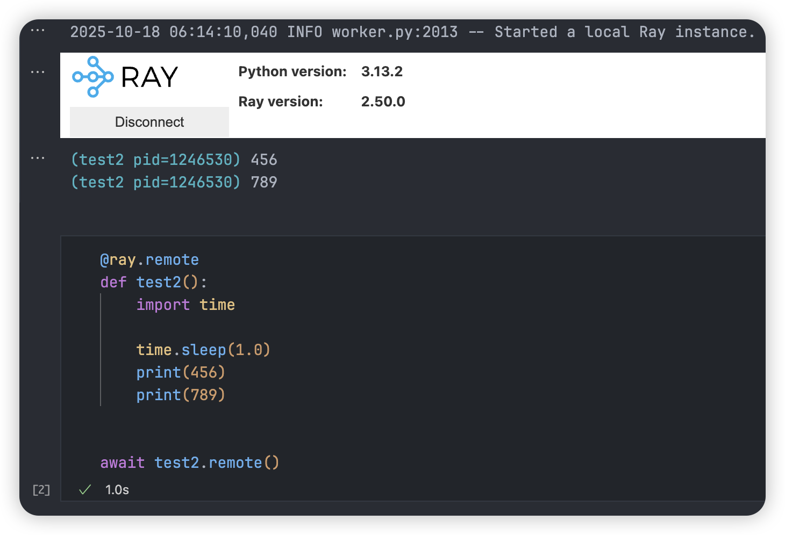
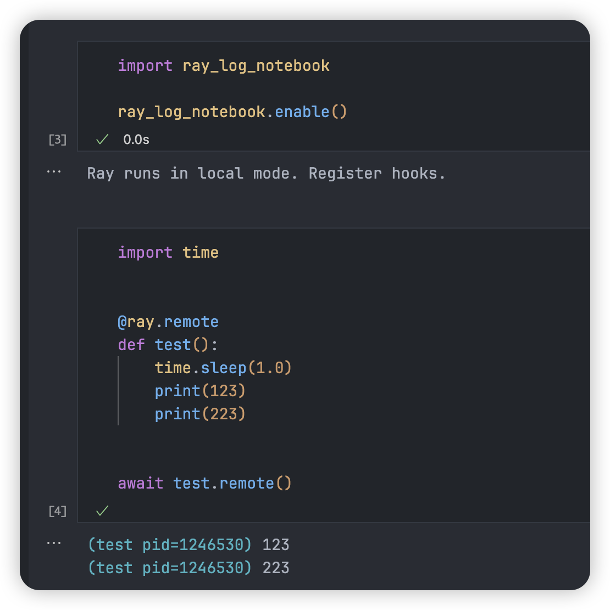

# Ray Log Notebook

**After (Fix routing of background thread output when no parent is set explicitly)[https://github.com/ipython/ipykernel/pull/1451], displaying in the latest executed cell would become the default behaviour. The PR is not release up to now(ipykernel 7.0.1) but may come soon.**


This is a tiny **FIX** for Ray to display logs under the **last executed cell** instead of **ray.init()** cell.

Q: Why would this happen?\
A: Ipykernel captures thread output and redir to the cell where thread is created.
This is desired in some scenarios, but definitely not for Ray, whose logging thread
is created upon `ray.init()` initialization.

Q: How can you fix this?\
A: Utilizing IPython Events and mock Ray's internal log event handler.
**This may be unstable because we depend on Ray's non-public API.**
In normal mode, Ray would log by emitting logs to `global_worker_stdstream_dispatcher`,
replacing the original handler with ours just works.
For client mode, things get trickier. `client_worker`'s LogStreamClient `log_client`
would receive remote log stream by gRPC and print to stdout/stderr.
We directly **mock replace** the `stdstream` method of that LogStreamClient instance.
There may be more robust and non-intrusive ways to do it,
for example capturing the `ray.init()`
cell output.

Q: How can I use this?
A: As simple as:

```python
% cell 1
import ray
ray.init()

% cell 2
import ray_log_notebook
ray_log_notebook.enable()

% cell 3
@ray.remote
def test_print():
    print("Woola!")

await test_print.remote()
```




Logs will always go to the last executed cell, instead of where the Ray Tasks are created.

Tested on Python 3.13 and Ray 2.50.0, generally should work but I don't have much time to test.

Related: 

1. [Prints from ray remote are coming in a previous notebook cell](https://github.com/ipython/ipykernel/issues/1370)
2. [Need public opt-out API for output routing from threads](https://github.com/ipython/ipykernel/issues/1289)
3. [Fix routing of background thread output when no parent is set explicitly](https://github.com/ipython/ipykernel/pull/1451)
